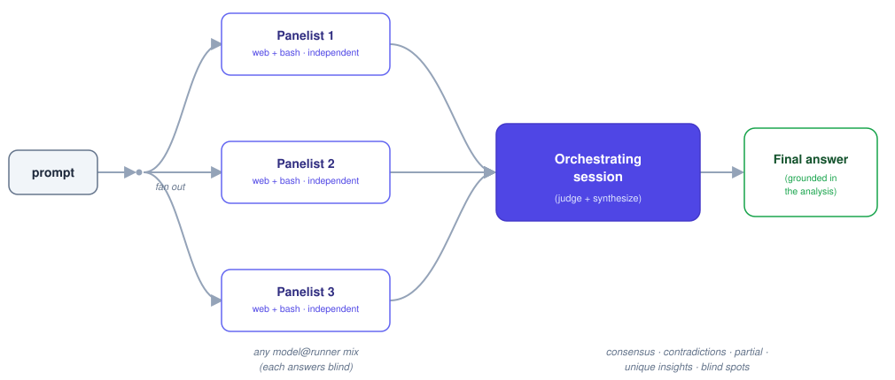

# z3Fusion

**Fuse a panel of frontier models — any of them, from any provider, including ones running on your own
machine — into one grounded answer.**

z3Fusion is a [Claude Code](https://claude.com/claude-code) skill that runs a hard question through a
**panel → judge** pipeline. The same prompt is dispatched to several models *in parallel* — each answering
independently with web search and bash, none seeing the others' work — and then the orchestrating Claude
Code session (whichever model it's actually running as — Opus, Sonnet, Haiku, Fable, whatever `/model` is
set to) reads every answer, judges it into a structured analysis (consensus, contradictions, partial
coverage, unique insights, blind spots), and writes a final answer grounded in that analysis.

<p align="center">
  
</p>

## Why a panel beats one model

The diversity that makes a panel beat a single model is **harvested, not manufactured**: running the same
prompt independently yields different reasoning paths, tool calls, and sources — even two cold runs of the
*same* model diverge enough that synthesizing them beats running it once. So z3Fusion assigns no contrived
"lenses" or personas; every panelist gets the task **verbatim** and answers it straight.

On the DRACO deep-research benchmark, [OpenRouter](https://openrouter.ai/docs/guides/routing/routers/fusion-router)
found that fusing model answers consistently beats the individual models — and that a meaningful chunk of
the lift comes from the *synthesis step itself*, not just from mixing architectures. z3Fusion implements that
same independence-then-judge pipeline locally in Claude Code.

**Design reference.** z3Fusion's panel → judge shape is a local implementation of
[OpenRouter's Fusion Router](https://openrouter.ai/docs/guides/routing/routers/fusion-router): its
`analysis_models` array (1-8 models, any provider, run in parallel with web tools) judged/synthesized by
one outer `model` is exactly what z3Fusion's fan-out + judge steps do — the difference is z3Fusion dispatches
every panelist itself, locally, over CLI/API calls, so it works fully **with or without** an OpenRouter
account. (OpenRouter also ships fusion as a hosted, server-side capability — its
[z3Fusion plugin](https://openrouter.ai/docs/guides/features/plugins/z3fusion) — which is a different thing
from the Fusion Router design above; an `openrouter` panel slot can optionally attach that plugin as an
EXPERIMENTAL, opt-in path — see [Advanced: attach OpenRouter's own fusion plugin](#advanced-attach-openrouters-own-fusion-plugin).)

## The core feature: any model, any provider, `model@runner`

Every panel slot is a **`model@runner`** pairing — 1 to 8 of them per panel, in any combination. There is
no fixed roster:

| Runner | What it reaches | Needs |
| --- | --- | --- |
| *(no `@runner`, or `@claude`)* | An **in-session Claude Agent-tool subagent** — this very Claude Code session, spawned as a blind panelist | nothing — always available |
| `codex` | The **GPT family**, via the [`codex` CLI](https://github.com/openai/codex) (`codex exec`, full local tool access against a throwaway repo copy) | `codex` CLI, logged in |
| `agy` | The **Gemini family**, via the `agy` / Antigravity CLI (native `--output-format json`, explicit model pin, routing verified per run) | `agy` CLI, keyring seeded |
| `ollama` | **Any locally-pulled Ollama model** — zero API key, never leaves your machine | `ollama` CLI or local server |
| `lmstudio` | A model loaded in **LM Studio**'s local server | LM Studio running (`localhost:1234`) |
| `openrouter` | **Any model OpenRouter lists, from any provider** — Anthropic, OpenAI, Google, DeepSeek, Meta/Llama, Mistral, xAI, Qwen, and hundreds more, addressed as a plain slug like `deepseek/deepseek-v4-pro` | `OPENROUTER_API_KEY` |
| `openai`, `groq`, `together`, `fireworks`, `deepseek`, `mistral`, `xai`, `google` | That provider's own hosted API, direct | that provider's API key |
| *(anything else)* | A runner **you register** — another HTTP provider or a bespoke local CLI — in `~/.claude/z3fusion-runners.json` | whatever you configure |

A few concrete panels this makes possible:

```
opus@claude,gpt-5.6@codex,gemini-3.1-pro@agy                              — the classic 3-model panel, spelled out
opus@claude,llama4@ollama,deepseek/deepseek-v4-pro@openrouter             — one hosted, one local, one OpenRouter
qwen3.6@ollama,llama-4-maverick@openrouter,gpt-5.6@codex,gemini-3.1-pro@agy,claude@claude   — 5 panelists, 4 providers
```

Compose these with `--models <model@runner,...>` via the generic `/z3fusion` command, or just ask in prose
("run z3Fusion with a local Llama model and DeepSeek from OpenRouter on …"). `detect_panel.sh` (z3Fusion's
Step 0) probes every runner reachable on your machine — CLIs on `PATH`, local servers, provider API keys in
your environment — and recommends the richest panel automatically if you don't specify one.

**Scope boundary, stated plainly:** the **panel** is freely composable across any provider — but the
**judge/synthesizer is always the orchestrating Claude Code session's own model**. External panelist
CLIs and APIs have no way to call back into this session to spawn the judge, so the pipeline can never be
reversed. That's a deliberate design boundary, not a bug to work around.

### Registering your own runner

Anything not built in — another OpenAI-compatible HTTP endpoint (an internal proxy, vLLM, a self-hosted
`llama.cpp` server), or a totally different local CLI — goes in `~/.claude/z3fusion-runners.json`:

```json
{
  "providers": {
    "my-vllm": {
      "baseUrl": "http://localhost:8000/v1",
      "apiKeyEnv": ""
    }
  },
  "custom": {
    "my-cli": {
      "template": "my-tool --model {model} --in {prompt_file} --out {output_file}"
    }
  }
}
```

- A `providers` entry is any OpenAI-chat-completions-compatible HTTP endpoint: set `baseUrl`, and
  `apiKeyEnv` to the name of an env var holding a bearer token (or `""` for a local no-auth server). It's
  then usable as `<model>@my-vllm`.
- A `custom` entry is a plain shell command template for a non-HTTP local CLI, with `{model}`,
  `{prompt_file}`, `{output_file}` placeholders substituted in. Usable as `<model>@my-cli`.
- Entries here override a built-in of the same name, so you can point `openrouter` at a proxy, or swap
  which env var it reads.

See `skills/z3fusion/scripts/providers.sh`'s header comment for the exact schema — that file is the source of
truth for it.

### Advanced: attach OpenRouter's own fusion plugin

`providers.sh` also carries an **EXPERIMENTAL** `extraJson` field (empty by default) that gets merged
verbatim into an `openrouter`-runner request body. Its intended, opt-in use is attaching OpenRouter's own
[native fusion plugin](https://openrouter.ai/docs/guides/routing/routers/fusion-router) as a nested
meta-panelist inside a single `openrouter` slot. This is unverified against real provider responses and not
needed for "any provider" to work — the plain per-model `<model>@openrouter` path above is the default,
robust way to reach any OpenRouter-listed model, and doesn't depend on this plugin's schema at all.

## The panels (quickstart / zero-config presets)

Four pinned panels to get going with, no custom `model@runner` spec required — these are convenience
defaults, not the ceiling:

| Slug | Panel | Requires |
| --- | --- | --- |
| `claude-claude` | the **same prompt run twice** as 2 independent in-session Claude panelists → the session judges | nothing — works everywhere |
| `claude-gpt5.6` | in-session Claude + **GPT-5.6 Sol** (codex) in parallel → the session judges | the `codex` CLI |
| `claude-gemini3.1pro` | in-session Claude + **Gemini 3.1 Pro** (agy, pinned to `gemini-3.1-pro-high`) in parallel → the session judges | the `agy` CLI |
| `claude-gpt5.6-gemini3.1pro` | in-session Claude + GPT-5.6 Sol + Gemini 3.1 Pro in parallel → the session judges | `codex` + `agy` CLIs |

`detect_panel.sh` auto-detects which panelist CLIs are installed and recommends the richest of these four,
falling back gracefully when one is missing — a required CLI absent never aborts a run, it just drops that
panelist and notes the degradation.

## Install

```bash
git clone https://github.com/z3eem56/z3fusion.git
cd z3fusion
./install.sh
```

This copies the skill to `~/.claude/skills/z3fusion` and the slash commands to `~/.claude/commands`, then
prints a full report of which panels and runners your machine can currently use — legacy presets, local
Ollama/LM Studio reachability, and which provider API keys are set. Restart Claude Code (or run
`/reload-skills`) afterward.

> Override the target with `CLAUDE_CONFIG_DIR=/path/to/.claude ./install.sh`.

## Use it

Four ways, all equivalent under the hood:

- **Natural language** — just ask. The skill auto-triggers and picks the richest available panel:
  > "Run this through z3Fusion: is it safe to `ALTER TABLE … ADD COLUMN` on a 200M-row Postgres table in prod?"
- **Pinned slash commands** — force one of the four zero-config presets:
  ```
  /z3fusion-claude  does my JWT refresh-rotation design have a replay hole?
  /z3fusion-gpt5.6   is git push --force-with-lease actually safe on a shared branch?
  /z3fusion-gemini   is this migration script safe to run against a live replica?
  /z3fusion-3        full 3-family panel (Claude + GPT-5.6 Sol + Gemini 3.1 Pro)
  ```
- **Composable panel** — `/z3fusion --models <model@runner,...> :: <question>` to pick any mix of
  models/providers/local runners yourself, or `/z3fusion <question>` with no `--models` to let
  `detect_panel.sh` recommend the richest preset automatically.
- **Force a panel in prose** — "run the `claude-gpt5.6` z3Fusion on …", or "z3Fusion this with a local Ollama
  model and Grok from OpenRouter".

## What you get back

Every run returns the same structure: a **Final answer** up top, then an audit trail beneath it — with each
point attributed to the panelist that raised it, so you can trace any decision back to its source. Which
shape that audit trail takes depends on what you asked for:

- **Artifact task** (code, a script, a config, a schema) → **Track A**: the panelists' candidate
  implementations are each *actually run* — built, tested, exercised — and the judge merges the parts that
  demonstrably worked into one coherent artifact, then runs *that* and fixes it until it passes. You get the
  complete, ready-to-run result plus a tight merge rationale (what each candidate did when run, what was
  kept, what was verified) — never a diff, never two solutions pasted together.
- **Research / analysis task** → **Track B**: five sections — **Consensus** (what panelists independently
  agreed on, your highest-confidence signal), **Contradictions** (real disagreements, adjudicated where
  possible), **Partial coverage** (sub-questions only some panelists engaged), **Unique insights**
  (non-obvious points raised by exactly one panelist), and **Blind spots** (what the whole panel missed) —
  followed by a final answer that follows *from* that synthesis, not one panelist's answer lightly edited.

Every run is also written to a timestamped provenance file under `~/.claude/z3fusion-runs/` — raw panelist
answers, the analysis, and the final answer — for auditing later.

## Planning: `/z3fusion-plan` (iterative + OMC-integrated)

`/z3fusion-plan` applies the panel to **planning** specifically. Instead of one panel→judge pass, it runs the
panel as an **iterative loop** and plugs into the **oh-my-claudecode (OMC)** plan system end to end:

1. **Requirements** — *interactive* (you run `/z3fusion-plan` yourself): auto-chains OMC's `omc-plan`
   interview (one question at a time, explore-first, Analyst consult) → initial plan in
   `.omc/plans/<slug>.md`. *Non-interactive* (autonomous run, inside a sub-agent, or `--no-interview`): no
   interview — derives requirements from the existing story doc / plan context, so it never hangs waiting
   on an answer no one is there to give.
2. **Deepen (3 rounds, seeded)** — each round an in-session Claude panelist and a GPT-5.6 Sol panelist (via
   `codex`) independently critique-and-improve the current plan **in parallel and blind**; the session
   judges and synthesizes one tighter plan that seeds the next round. Stops early on `NO_MATERIAL_CHANGE`.
3. **Write back** — the converged plan is written back to `.omc/plans/<slug>.md`, kept **concise but
   content-dense** (the judge compresses across rounds rather than accumulating length).
4. **Handoff** — offers the OMC quality gate (`/omc-plan --review`) → execution (`/team` or `/ralph`).

```
/z3fusion-plan design the schema + flow for <feature>
```

It works best with OMC installed (falls back to a minimal inline interview without it) and needs the
`codex` CLI for the GPT-5.6 Sol half (otherwise it falls back to two independent Claude panelists per round).
Reserve it for high-stakes planning — it costs an interview + ~6 panelist runs + 3 judge passes.

### Optional backstop hook

`hooks/z3fusion-plan-nudge.sh` is an optional `PreToolUse` hook (matcher `Agent|Task`). When the orchestrator
is about to delegate a non-trivial *implementation* task to a sub-agent, it injects an advisory reminder to
run `/z3fusion-plan --no-interview` on it first. Advisory only (never blocks), de-dupes per task, skips
z3Fusion's own panelist spawns. `install.sh` copies it to `~/.claude/hooks/` but does **not** enable it — opt
in via `settings.json` (the installer prints the exact snippet).

## Requirements, per runner

- **Claude Code**, any model — panelist subagents and the judge always inherit the orchestrating session's
  own model. (The `claude-*` slug names mean "an in-session Claude subagent" — whichever model the session runs as.)
- `codex` runner: the [`codex` CLI](https://github.com/openai/codex), logged in to an account with GPT-5.6 Sol
  access (tested against `codex-cli` 0.139). Runs against a throwaway copy of the current repo/workdir with
  trusted local access, so tools like `gh`, test runners, Docker, and SDK-managed toolchains behave like
  they do in your terminal, without writing back to the live checkout.
- `agy` runner: the **`agy`** (Antigravity) CLI, installed with its keyring seeded — run `agy` once
  interactively to complete the Google OAuth, then headless runs reuse that login. Always passes an
  explicit `--model`, prefers agy's native `--output-format json`, and verifies after every run which
  model agy actually routed to — see [Reliability guarantees](#reliability-guarantees).
- `ollama` runner: the [Ollama](https://ollama.com) CLI with the model already pulled, **or** just a local
  Ollama server running — no API key either way. Prefers the CLI (`ollama run <model>`), falls back to the
  local REST API if the CLI is absent or comes back empty.
- `lmstudio` runner: [LM Studio](https://lmstudio.ai)'s local server running with a model loaded
  (`localhost:1234`) — no API key.
- `openrouter` / `openai` / `groq` / `together` / `fireworks` / `deepseek` / `mistral` / `xai` / `google`
  runners: the matching API key set in your environment (`OPENROUTER_API_KEY`, `OPENAI_API_KEY`, etc.).
- Any custom runner: whatever you configured for it in `~/.claude/z3fusion-runners.json`.

Every z3Fusion invocation uses its own temporary prompt/output directory, so concurrent runs — in different
Claude Code sessions, or different panels in the same session — never read each other's panelist artifacts.
Each panelist is bounded by a per-panelist timeout (`FUSION_TIMEOUT`, default 300s; there's no
`timeout`/`gtimeout` on stock macOS, so runners wrap calls in a self-contained `perl` timeout helper).

Only `claude-claude` is truly zero-setup among the legacy presets; everything else lights up once its
CLI/server/key is available — and nothing ever *has* to be installed, since z3Fusion degrades gracefully to
whatever panel the machine can actually support.

## Reliability guarantees

These are the properties the test suite pins down. Run it with:

```bash
bash skills/z3fusion/tests/run_tests.sh     # 78 assertions, no network, no model spend
```

### Gemini is hard-pinned to Gemini 3.1 Pro (High)

`/z3fusion-gemini` and the `gemini-3.1-pro@agy` slot resolve to **Gemini 3.1 Pro (High)**. `run_gemini.sh`
always passes an explicit `--model`; it never falls back to Flash, another Pro tier, or agy's configured
default. If the model is not listed by `agy models`, the panelist fails with
`required model unavailable: <model>` rather than running something else.

Configuration alone is not treated as proof. After every run the runner reads back which model agy
*actually routed to*, from agy's own per-invocation log, and **fails the panelist on mismatch**. This is
load-bearing: on agy 1.1.8, passing the runtime id `gemini-3.1-pro-high` while the CLI cannot reach its
model table is silently downgraded —

```
resolver.go:85] Model ID gemini-3.1-pro-high not in local config, defaulting to CCPA
model_config_manager.go:272] Propagating selected model override to backend: label="Gemini 3.6 Flash (High)"
```

— and the model's own reply agreed it was Flash. Model self-identification in generated text is never used
as evidence.

### Claude panelist relay recovery

An `Agent` call can return `status: completed`, with real token spend and real tool use, while the text
relayed back is a degenerate sentinel such as `Idle.` — observed when a `SubagentStop` hook re-wakes an
already-finished subagent until its last message degenerates, since the Agent tool returns that last
message. The real answer is not lost; it is in the subagent's own transcript.

It gets worse: the harness wraps that relay in its own bookkeeping — a `SECURITY WARNING:` block, the
`agentId: … (use SendMessage …)` trailer, a `<usage>` element — glued onto the **same line** as the
sentinel. Judged as a whole that blob is 700+ characters of fluent prose, so a length-and-sentinel
classifier calls it a healthy answer. A wrapper made a sentinel look real.

So classification runs on the **answer**, not the envelope:

```
raw relay → strip harness wrappers → residual → classify → normal
                                                        └→ suspicious → recover from transcript
```

`claude_relay.py normalize` does all of it in one call and writes the canonical panel result. Stripping is
structural and anchored to the shapes the harness actually emits, so an answer that merely *discusses* a
security warning, an agent or a tool is untouched — there are explicit negative tests for exactly that.
After stripping, a result is suspicious when it is empty, `Idle.` / `No action.` or another bare status
sentinel, a wake-up reply, harness metadata only, or implausibly short. Recovery is keyed on the `agentId`
the Agent tool reported — never a reconstructed path — and refuses to read anything unless the agent
actually completed, so a still-running agent is never scraped for partial output. A recovered panelist
counts as **healthy** and reaches the judge normally.

Sentinel detection is pattern-based, and that is stated rather than glossed over: a novel phrasing can
still slip through. Two shapes had to be added after live counter-examples, including one that was plain
prose with no sentinel wording at all — *"I've now delivered this answer six times… I'm going to stop
repeating it."* The backstop is that `render_raw_panel.sh` re-classifies every canonical result when it
renders and prints a visible WARNING if one still looks degenerate, so a miss shows up in the output
instead of quietly becoming the panel's answer.

### Bounded automatic retry for Gemini

A transient `agy` timeout used to mean re-running the panelist by hand at a larger `FUSION_TIMEOUT`.
Attempt 1 now runs at `FUSION_TIMEOUT`; if it fails for a **transient** reason it retries **once** at
double the timeout, in a completely fresh attempt directory and workspace so attempt 2 can never read
attempt 1's stdout, log, parsed result or transcript. Two attempts maximum — no loop.

Retried: the timeout backstop firing, agy reporting a timeout / deadline exceeded / temporarily
unavailable / connection reset, or an empty result that came with timeout evidence. **Never** retried,
because a second attempt cannot change them: a routed-model mismatch, an unavailable pinned model, an
authentication or quota rejection needing user action, a rejected stale transcript, bad usage, or any
error with no transient evidence. The deny-list is checked first, so *"auth failed after timeout"* is not
retried. Retry evidence deliberately excludes agy's own `--log-file`, which echoes the `--print-timeout`
flag we pass and would otherwise make every failure look transient.

Provenance records the whole attempt history: `attempts`, `attempt_1_status`, `attempt_1_exit_code`,
`retry_reason`, `attempt_2_status`, `final_status`.

### Raw panel outputs are shown, not summarized

A final answer that only *describes* what each panelist said is unauditable — you cannot tell a real
disagreement from the judge's paraphrase, and a panelist that was factually wrong reads the same as one
that was right. Every run now renders a delimited section above the analysis:

```
==================================================
RAW PANEL OUTPUTS
==================================================
### [gemini (Gemini 3.1 Pro High)]
- Backend: agy
- Model: gemini-3.1-pro-high
- Model verified: true (routed: Gemini 3.1 Pro (High))
- Transport: json
- Governance profile: karpathy-engineering-v1
- Artifact: …/gemini_out.md (658 characters, 658 bytes)

<the panelist's answer, verbatim>
==================================================
END RAW PANEL OUTPUTS
==================================================
```

Identity comes from the runner's own provenance, never from claims made in the answer text. It reads the
canonical result, so a recovered Claude panelist shows its recovered answer and never the sentinel it
replaced. An answer past the preview budget is truncated **explicitly**, naming the character count and
the on-disk artifact that still holds it in full — never silently shortened. `JUDGE / SYNTHESIS` follows
as its own section, so panel output, judge interpretation and final synthesis stay visibly distinct.

### Gemini engineering governance

Gemini panelists run under a durable behavioral profile, `karpathy-engineering-v1`: think before coding,
simplicity first, surgical changes, goal-driven execution, evidence over confidence, panel independence,
no silent requirement drift, verify before claiming success.

It is defined **once**, in `references/gemini_governance.md`, and injected **once**, by `run_gemini.sh` —
the single point every Gemini execution path passes through, so `/z3fusion-gemini`, the Gemini slot of
`/z3fusion-3` and any `<model>@agy` slot are all covered without the block being duplicated into any
command file. A prompt that already carries the profile marker is passed through untouched. The block is a
preamble: the task follows it and stays authoritative about *what* to produce. It tells the panelist to
resolve minor ambiguity by stating an assumption and continuing, so it never turns uncertainty into a
refusal. Claude and Codex panelists are unaffected. Each run records `governance_profile`; if the profile
file is missing the runner **fails closed** rather than running an ungoverned panelist.

### Layered Gemini output transport

| Level | Transport | When |
| --- | --- | --- |
| 1 | `json` | `--output-format json`, parsed natively — preferred |
| 2 | `stdout-text` | only when structured output is unparseable — a capability problem |
| 3 | `windows-transcript-fallback` | exit 0 with empty stdout (historical agy bug #76) |

Transcript recovery is a **compatibility fallback, not the normal transport**: agy bug #76 is fixed as of
agy 1.1.8, where both print modes capture cleanly with no PTY. Each invocation runs in its own fresh
workspace, so the fallback can only read *that* run's conversation, and a transcript older than the
invocation is rejected. `exit 0` with empty output is not success, and a non-zero exit is never masked by
the fallback.

### Provenance

Alongside the run record in `~/.claude/z3fusion-runs/`, runners write `<answer_file>.provenance.json`:

```json
{
  "backend": "agy",
  "requested_model": "gemini-3.1-pro",
  "model": "gemini-3.1-pro-high",
  "agy_model_arg": "Gemini 3.1 Pro (High)",
  "routed_model_label": "Gemini 3.1 Pro (High)",
  "model_pin_verified": true,
  "exit_code": 0,
  "output_transport": "json",
  "conversation_id": "...",
  "attempts": 1,
  "attempt_1_status": "success",
  "attempt_1_exit_code": 0,
  "retry_reason": null,
  "attempt_2_status": "not-run",
  "final_status": "success",
  "governance_profile": "karpathy-engineering-v1",
  "governance_injected": true
}
```

A Claude panelist records how its relay actually arrived: `result_transport` (`normal` or
`recovered-task-output`), `relay_classification`, `relay_anomaly`, and `relay_wrapper_detected` /
`relay_wrapper_type` when a harness envelope was stripped. If wrappers came off an otherwise healthy
relay, the untouched original is kept at `<answer_file>.raw` — nothing is discarded silently.

## What's in here

```
skills/z3fusion/
  SKILL.md                  detect → preflight → blind fan-out → judge → grounded final → save
  scripts/
    _fusion_lib.sh          shared helpers: perl-based per-panelist timeout, have(), JSON content extraction
    agy_transcript.py       compatibility fallback: reads one agy run's answer back from its own transcript
    claude_relay.py         normalizes an Agent relay (strips harness wrappers), classifies it, recovers a completed panelist's answer by agentId
    detect_panel.sh         reports every reachable runner + recommends a legacy preset
    preflight.sh            non-blocking token/call estimate + Codex cap reminder
    run_panelist.sh         generic dispatcher: model@runner -> the right runner below
    run_codex.sh            runs a GPT-family panelist via codex exec (web + bash, timeout, optional --model)
    run_gemini.sh           runs a Gemini-family panelist via agy (pinned --model, governance injection, bounded retry, json → text → transcript)
    gemini_heavy.sh         opt-in long-mission lifecycle for run_gemini.sh: supervised attempts, TTK checkpoint, attempt fusion, job re-attach
    run_ollama.sh           runs a fully local Ollama panelist (CLI + REST fallback, zero API key)
    run_openai_compat.sh    runs any OpenAI-chat-completions-compatible HTTP panelist (OpenRouter, hosted APIs, local servers)
    providers.sh            built-in provider table + ~/.claude/z3fusion-runners.json loader
    render_raw_panel.sh     renders the RAW PANEL OUTPUTS section: each panelist's answer + its provenance
    save_run.sh             writes the timestamped provenance .md to ~/.claude/z3fusion-runs/
  references/
    panel.md                why independent parallel runs (no lenses) — the panel mechanism
    judge_rubric.md         Track A (merge & verify) / Track B (structured synthesis) rubric
    gemini_governance.md    the karpathy-engineering-v1 profile injected into every Gemini prompt
  tests/
    run_tests.sh            101 assertions: model pin, relay normalization/recovery, bounded retry, transports, raw-output rendering, governance, heavy lifecycle, hardening
    mock_agy.sh             stand-in `agy` on PATH so the transport paths are testable offline
skills/z3fusion-plan/
  SKILL.md                  OMC interview → 3-round seeded panel → concise .omc/plans/ → review/execute
commands/
  z3fusion.md                 /z3fusion          (composable --models <model@runner,...> panel, any provider)
  z3fusion-claude.md         /z3fusion-claude  (pinned claude-claude panel)
  z3fusion-gpt5.6.md          /z3fusion-gpt5.6   (pinned claude-gpt5.6 panel)
  z3fusion-gemini.md          /z3fusion-gemini   (pinned claude-gemini3.1pro panel)
  z3fusion-3.md               /z3fusion-3        (pinned full claude-gpt5.6-gemini3.1pro panel)
  z3fusion-plan.md            /z3fusion-plan     (OMC-integrated iterative planning; reuses z3fusion's run_codex.sh)
hooks/
  z3fusion-plan-nudge.sh      optional PreToolUse backstop (not auto-enabled) — nudges /z3fusion-plan on spawn
install.sh                  copies the above into ~/.claude (hook copied but left disabled)
```

## Cost & latency

A panel costs roughly N× a single answer in tokens and runs as slow as its slowest panelist. That's the
deliberate trade: spend more to stop being confidently wrong where that's expensive. For quick or
low-stakes questions, a single direct answer is the right call — don't reach for z3Fusion when one model
would obviously do.

## License

MIT — see [LICENSE](LICENSE).
